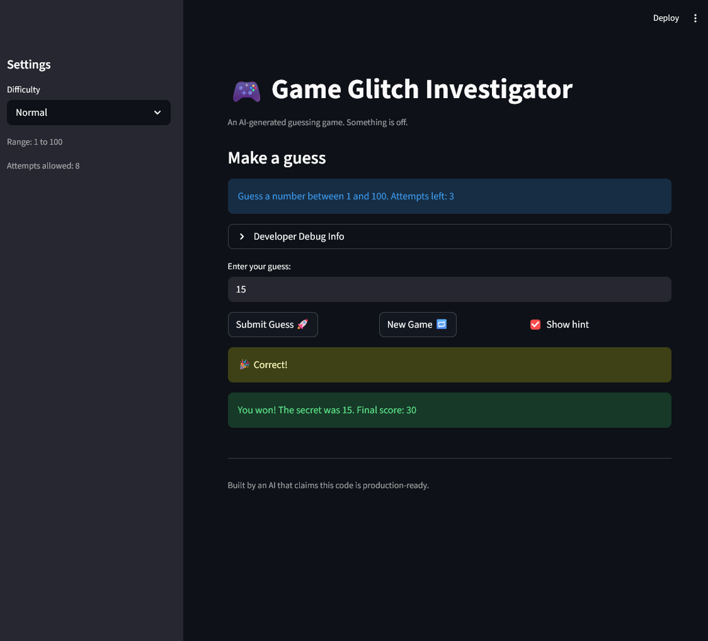

# 🎮 Game Glitch Investigator: The Impossible Guesser

## 🚨 The Situation

You asked an AI to build a simple "Number Guessing Game" using Streamlit.
It wrote the code, ran away, and now the game is unplayable.

- You can't win.
- The hints lie to you.
- The secret number seems to have commitment issues.

## 🛠️ Setup

1. Install dependencies: `pip install -r requirements.txt`
2. Run the broken app: `python -m streamlit run app.py`

## 🕵️‍♂️ Your Mission

1. **Play the game.** Open the "Developer Debug Info" tab in the app to see the secret number. Try to win.
2. **Find the State Bug.** Why does the secret number change every time you click "Submit"? Ask ChatGPT: _"How do I keep a variable from resetting in Streamlit when I click a button?"_
3. **Fix the Logic.** The hints ("Higher/Lower") are wrong. Fix them.
4. **Refactor & Test.** - Move the logic into `logic_utils.py`.
   - Run `pytest` in your terminal.
   - Keep fixing until all tests pass!

## 📝 Document Your Experience

- [ x ] Describe the game's purpose.

  This is a game of guessing a correct number between 1 and 100 that is secret. You are given 7 chances and if you get it correct you win points and if you don't get it correct you lose points.

- [ x ] Detail which bugs you found.

  There was 4 bugs that I found, the "hard" difficulty was easier than the "normal" difficulty, the user was allowed to input guesses that weren't between the numbers of 1 and 100, the "new game" button was weird at first (wouldn't work unless you refresh page, the # of attempts went up from 7 to 8) and finally the hints you were given ("go higher" and "go lower") weren't accurate at first.

- [ x ] Explain what fixes you applied.

  Fixes that were implemented were changing the number range for the "hard" difficulty from 1-50 to 1-200, decreasing the odds of guessing the correct number in 7 attempts. Next I added a number check in parse_guess to verify that the number input by the user was between the numbers 1 and 100. Another change I made was in the check_guess function where the go higher and go lower hints were inaccurate, they were inverted where if the guess was too high it would say too high and the same for go lower, these were switched in order to be correct. The final fix revolves around the reset button functionality, instead of displaying 8 attempts to the user when you start a new game it displays the correct number of 7.

## 📸 Demo

- [ x ] 

## 🚀 Stretch Features

- [ ] [If you choose to complete Challenge 4, insert a screenshot of your Enhanced Game UI here]
