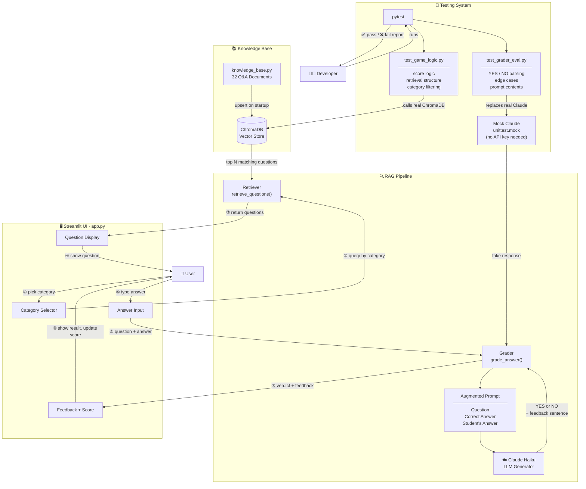

# System Diagram

## Component Summary

| Component | File | Role |
|---|---|---|
| Knowledge Base | `knowledge_base.py` | 32 static Q&A documents |
| Vector Store | ChromaDB (in-memory) | Stores + retrieves documents by semantic similarity |
| Retriever | `rag_utils.retrieve_questions()` | Queries ChromaDB by category, returns N questions |
| Grader | `rag_utils.grade_answer()` | Builds augmented prompt, parses Claude's response |
| Generator | Claude Haiku (Anthropic API) | Produces YES/NO verdict + kid-friendly feedback |
| UI | `app.py` | Streamlit interface — ties all components together |
| Logic Tests | `tests/test_game_logic.py` | Deterministic tests for scoring and retrieval |
| Eval Tests | `tests/test_grader_eval.py` | Mocked tests for AI grading pipeline |

## Where Humans Are Involved

- **User** — selects category, reads questions, submits answers, sees feedback
- **Developer** — runs `pytest` to verify the system behaves correctly before/after changes
- **Mock layer** — replaces Claude in tests so developers can check the parsing logic without API cost or network dependency
